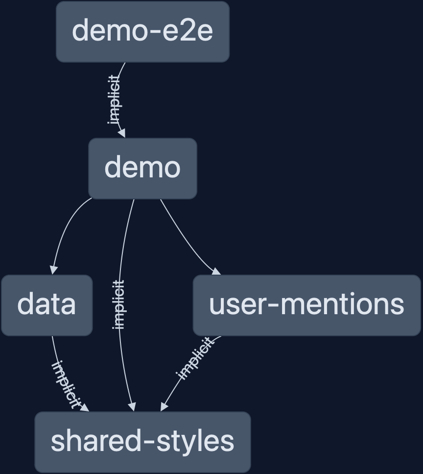

# User Mention Challenge


## Project Structure

```sh
├── apps
│   ├── demo
│   └── demo-e2e
└── libs
    ├── shared
    │   ├── data
    │   └── styles
    └── user-mentions
```

**shared-data** Contains common interfaces, pipes, directives, and services

**shared-styles** Contains some basic SCSS theming files

**user-mention** library dedicated to the functionality of tagging users in a comment. See the [README](libs/user-mentions/README.md) for the library to learn more about it.

**apps-demo** demo application utilizing the above libraries

## Usage

The core of the functionality comes from a single `<div>`:

```html
<div mentionUsers contenteditable="true" id="new-comment-input" data-placeholder="Start typing a new comment..." role="textbox" (userMentioned)="logUserSelection($event)" formControlName="message"></div>
```

`mentionUsers` directive injects the listeners for the pop-up menu.

`contenteditable` is a native element attribute allowing the contents to be.. well, edited.

`(userMentioned)` output runs every time a user is successfully tagged

`formControlName` is used to attach the `<div>` to a reactive form in the component.

**Note** There is a "hidden" directive at work here, `ContenteditableControlValueAccessorDirective` attaches to node that have both attributes `formControlName` and `contenteditable`. This directive allows an arbirary `<div>` to be connected to a `FormControl`. If the form is disabled for whatever reason, the `contenteditable` attribute will be set to `false` preventing any changes.

## Getting Started

### Installation and Requirements

### Requirements

- `git` is available on your computer (instructions [here](https://github.com/git-guides/install-git))
- `node` has been installed (instructions [here](https://nodejs.org/en/learn/getting-started/how-to-install-nodejs))
  - **Requires v20.9.0 at a minimum**
- `yarn` for package management is recommended, `npm` can also be used as normal

### Installation

1. Clone this repository:

```shell
> git clone https://github.com/wgd3/user-mention-challenge
```

2. Install packages

```shell
# for yarn users
> yarn

# if not using yarn
> npm install
```

### Running The App

Nx has it's own CLI for the projects in a repository. To run the demo app:

```shell
> npx nx serve demo

Initial Chunk Files | Names         |  Raw Size
polyfills.js        | polyfills     |  82.71 kB |
main.js             | main          |  53.56 kB |
styles.css          | styles        |   2.53 kB |

                    | Initial Total | 138.81 kB

Application bundle generation complete. [1.419 seconds]
Watch mode enabled. Watching for file changes...
  ➜  Local:   http://localhost:4200/
```

If you want to see the visual representation about how these libraries are linked, you can use Nx's dependency graph:

```shell
> npx nx dep-graph

 >  NX   Project graph started at http://127.0.0.1:4211/projects
```

Click "Show All Projects" on the left to see this diagram:


